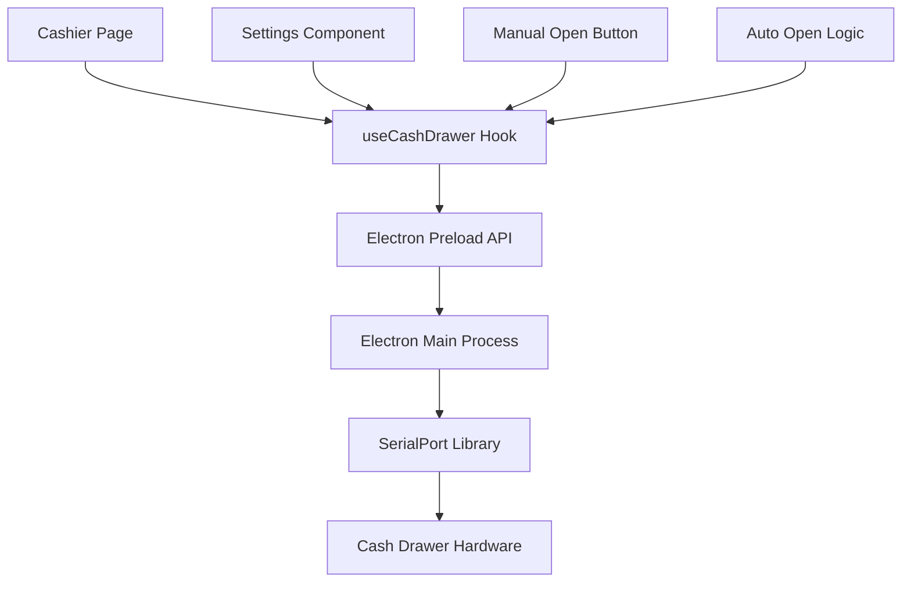
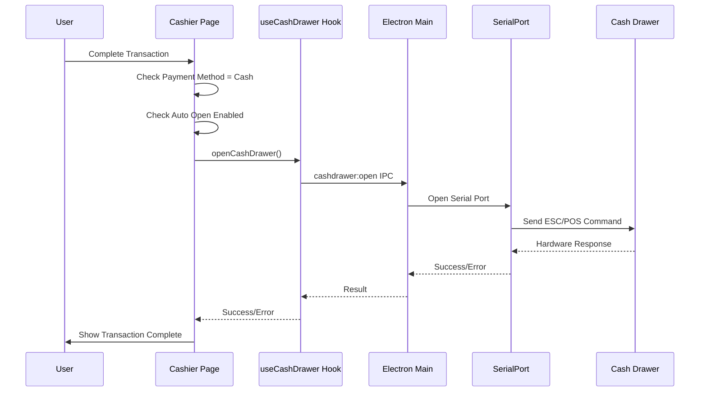
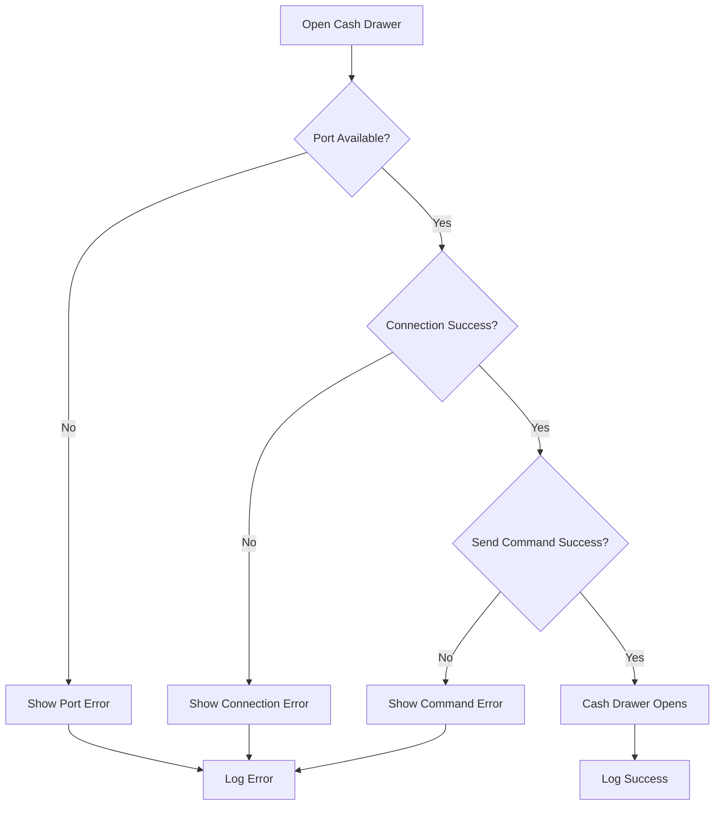
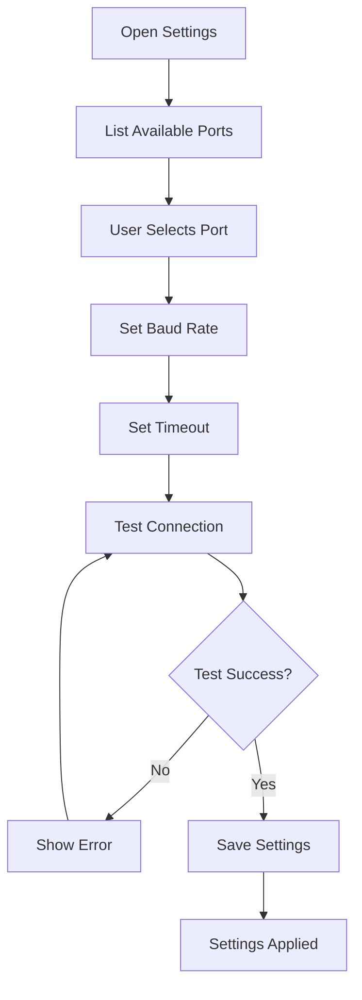
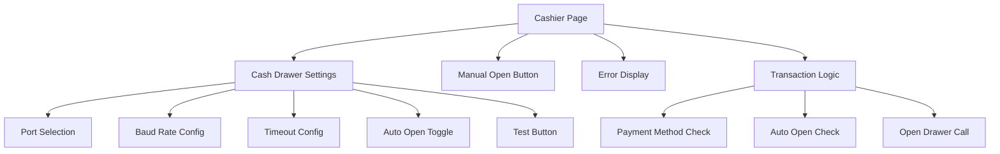
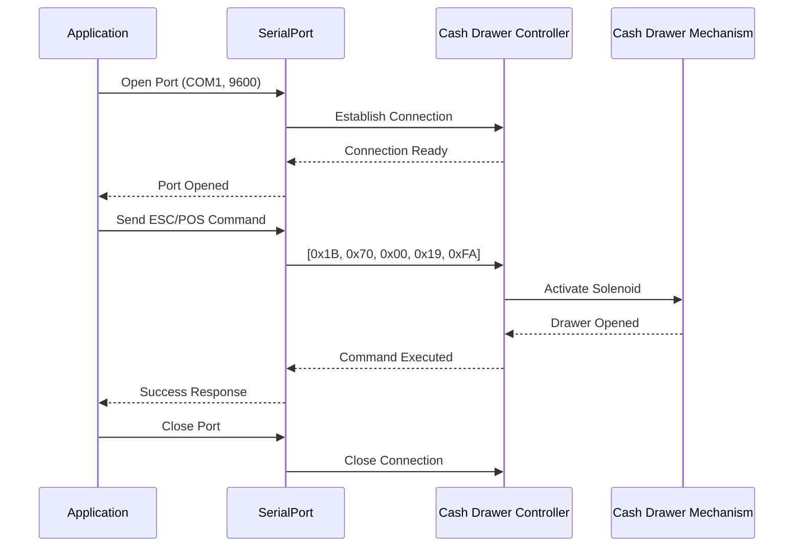
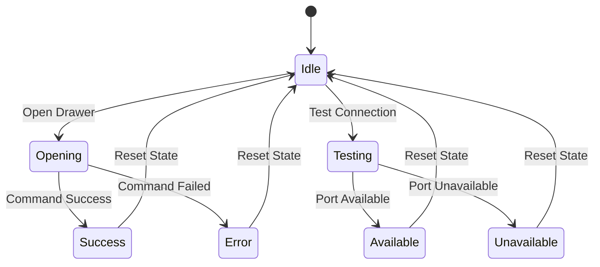
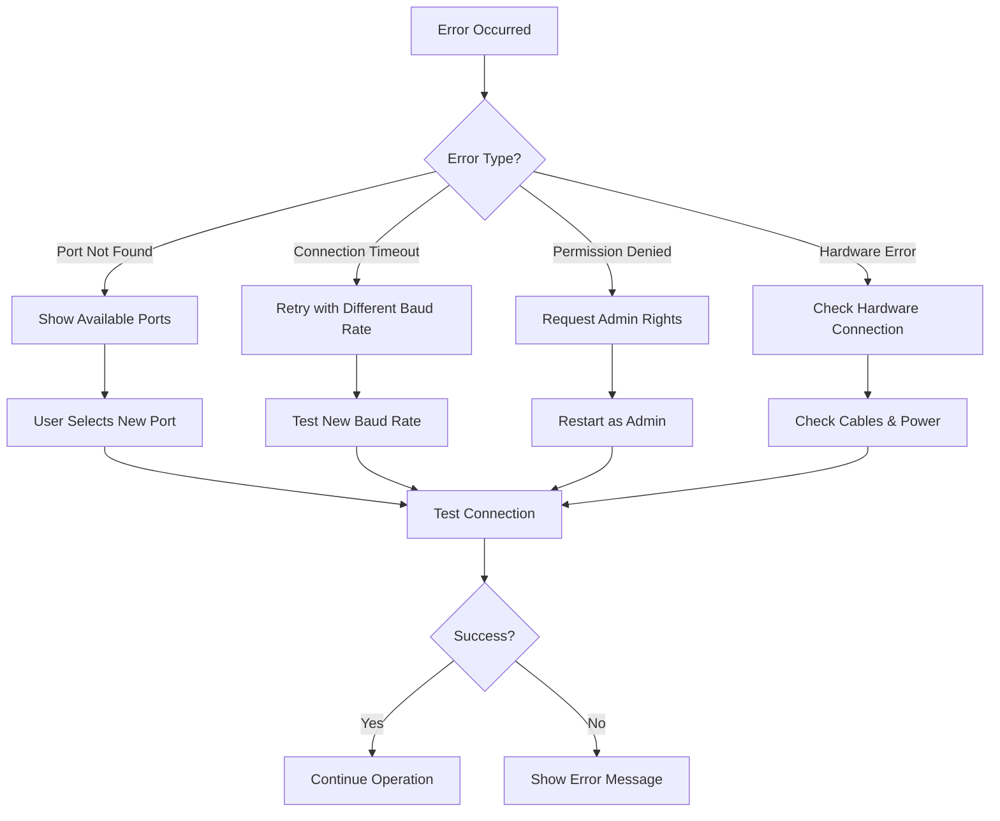
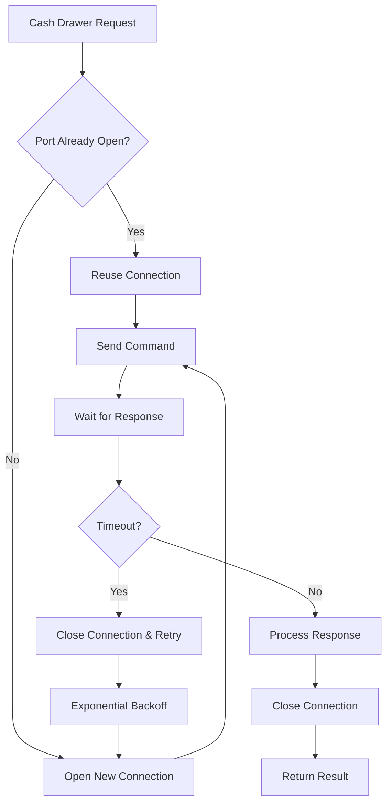

# Cash Drawer Integration Flow

## System Architecture

## Transaction Flow

## Error Handling Flow

## Configuration Flow

## Component Structure

## Hardware Communication

## State Management

## Error Recovery

## Performance Optimization

---

**Note**: These diagrams show the complete flow of cash drawer integration in Studio POS, including error handling, state management, and performance optimization strategies.

